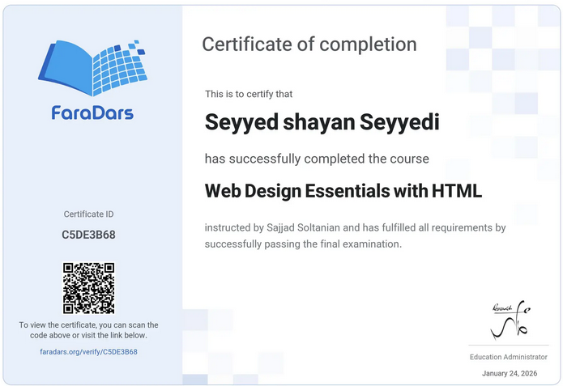
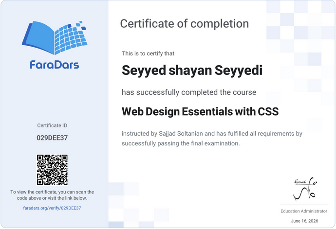

  

  <a href="https://git.io/typing-svg">
    <h1>  </h1>
  </a>

  
  
  
  
  ---

  <table width="100%">
    <tr>
      <th>💪🏻 My Skills 💪🏻</th>
    </tr>
    <tr>
      <td align="center">
        
        
        
        
        
        
        
      </td>
    </tr>
  </table>
  
  ---

  <table width="100%">
    <tr>
      <th>⚡ Currently learning ⚡</th>
    </tr>
    <tr>
      <td align="center">
        
        
        
        
        
        
        
      </td>
    </tr>
  </table>
  
  ---

  <table width="100%">
    <tr>
      <th>✨ Front-End ✨</th>
    </tr>
    <tr>
      <td align="center">
        
        
        
      </td>
    </tr>
  </table>
  
  ---

  <table width="100%">
    <tr>
      <th>🧠 Back-End 🧠</th>
    </tr>
    <tr>
      <td align="center">
        
        
      </td>
    </tr>
  </table>
  
  ---

  <table width="100%">
    <tr>
      <th>🐧 Gnu/Linux 🐧</th>
    </tr>
    <tr>
      <td align="center">
        
        
        
        
      </td>
    </tr>
  </table>
  
  ---

  <table width="100%">
    <tr>
      <th>⚙️ Development Tools ⚙️</th>
    </tr>
    <tr>
      <td align="center">
        
        
        
        
        
      </td>
    </tr>
  </table>
  
  ---
  
  <table width="100%">
    <tr>
      <th>📑 My Certificates 📑</th>
    </tr>
    <tr>
      <td align="center">
        
        
        
        
        
        
        
      </td>
    </tr>
  </table>
  
  ---
  
  <table width="100%">
    <tr>
      <th>🧾 My quizzes 🧾</th>
    </tr>
    <tr>
      <td align="center">
        
      </td>
    </tr>
  </table>

